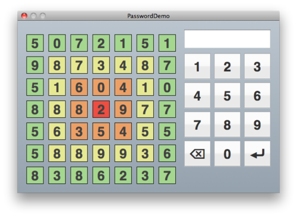
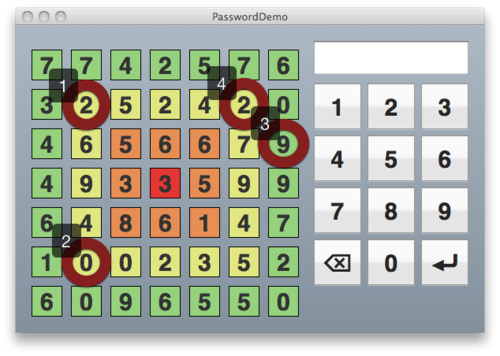

Most credit card fraud occurs because, somehow the fraudster is able to see the card owner's PIN number. The most common way this happens is hidden cameras at ATM machines recording PIN numbers or dodgy Chip &amp; PIN readers fitted with monitoring devices (this is significantly less common).

The way to deal with this crime is to make the PIN change every time an attempt is made. There are already systems that utilise a small device (usually a key-fob) that generates a password on request that will only last for 30 seconds. While this is a good idea, you are relying on a device that you might leave at home.

This is a possible solution to the problem. I can't take credit for the concept, I read about it several years ago, but have not seen another mention of it since.

The main idea is that you remember a series of positions, not a series of numbers. Instead of remembering the PIN '8361', you remember 4 boxes in order on a grid.

When an attempt at the password is to be made, each square in the grid is filled with a single, random digit from 0-9 inclusive. The only reason for the colours is to make it easier to pick out your squares. The user types in the numbers that appear in each position that makes up their password.

For example, in the above picture, if my password is made of the 4 corners starting top-left and moving clockwise, for this attempt my password would be '5178'. However as the numbers are generated randomly to fill the squares, they would be different the next time I am asked to enter my PIN.

The size of the grid can be set to anything in the concept. I have used a 7x7 grid for 2 reasons:
 - It is small enough that remembering positions and finding them quickly is relatively easy, especially with the colours.
 - The grid has 49 squares. On average, there will be almost 5 of any 1 number in the grid. This means that if you type '8' while someone is watching, they will probably have no idea which 8 you are referring to. In the case above, there are 9 instances of '8'. This is abnormal, but demonstrates the point well.

I can see 2 ways to crack this. Firstly, trying all passwords. This is known as 'brute force' cracking and usually works by trying everything from '0000' to '9999'. However in this case it would not work in the same way as the password changes each time. Instead, it would be luck each time it guessed it as to whether it guessed correctly. Each guess has the same chance of 1 in 9999.

The second way to crack the password would require the attacker to record not only the guess, but also the grid used for many attempts. This would be incredibly difficult and time consuming for an attacker to do, let alone discreetly. I have demonstrated this concept to people and, even after knowing the method and watching the grid and my constant attempts for long periods of time, they were unable to work out my pattern PIN. I think to do so would require time, effort, many sheets of scribbled notes and photos of the grids for, potentially, hundreds of attempts, although I would bet most of the time it could be done with 10 or so grids, that is 9 more breaches of security than with Chip & PIN.

#### Conclusion?

This is obviously still fallible, but I think it provides much better security than the current Chip & PIN system. Researchers in the security group at Cambridge have devised ways to circumvent Chip & PIN authentication entirely, removing the need for a valid PIN, however this it is unlikely that this would ever get widespread adoption by criminals as 'social hacking' of users is often far easier.

Can this actually be implemented? Probably not. If a large percentage of people end up writing their PINs down on their phones with the current system, being even more complicated this system would probably not work.

<a class="download-button" href="http://cl.ly/zb6dR">Download Demo App</a>