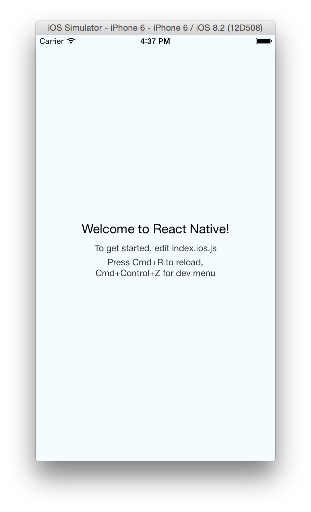
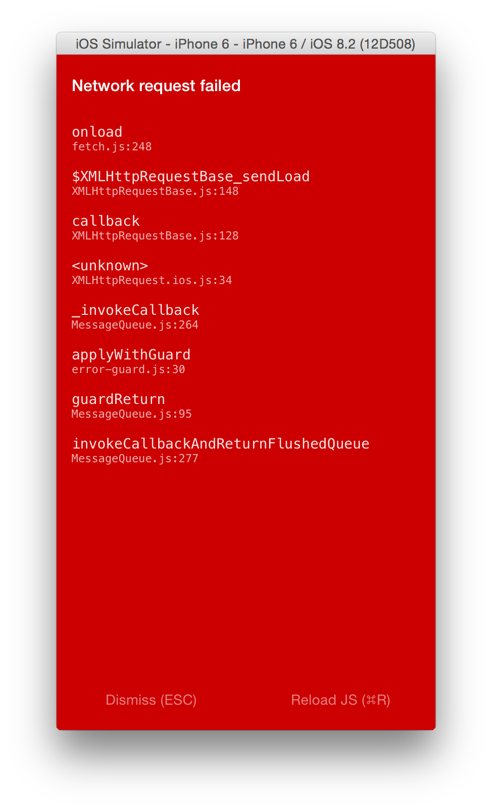

[React Native](http://facebook.github.io/react-native/) was released this week. For those who aren't familiar with it, the short version is that React Native brings the React architecture to iOS, letting the developer write Javascript that runs asynchronously, off the main thread, to orchestrate _native_ components.

I was looking forward to trying React Native, so with an hour or two spare on the train home, I ran through the first tutorial.

#### Starting a Project

This is as easy as `react-native init AppName`. It sets up an Xcode project for the app, installs a selection of Node modules that it requires, and then leaves you with the next steps:

> Next steps:
> Open /Users/dan/Code/HelloWorld/HelloWorld.xcodeproj in Xcode
> Hit Run button

So I did.

Immediately the iOS simulator is running, showing a display with instructions about how to proceed.

It almost looks as if this process has been optimised for conversion rates, it's clearly leading me through and trying to get me to the point of my first app, or my first 'wow moment'.

I opened up `index.ios.js` in Sublime Text and started looking through. As might be expected, it was incredibly simple, containing just one method, `render`, and some styles in very CSS-looking Javascript. Having a simple Hello World might be appealing to many, but I think it's often overrated. An example from web development might be Flask – while the Hello World might be 5 lines, major projects will usually end up re-creating Django in an effort to create a nice codebase. The first impression of React Native was similar – fast, but will the code scale up to a large project. This remains to be seen.

#### Programming Model

I have not tried using React on the web, so this experience may be quite different for someone who has, but I found the tutorial somewhat lacking in detail about the programming model. I already knew a bit about how React Native worked under the hood, how the Javascript and native components interacted, and what made that fast, but I didn't know much about the reactive programming model that React took, and I think it was a shame this wasn't emphasised more in the tutorial, as I see it as one of React's greatest strengths.

The equivalent to view controllers in React has a `state` on it that is observed from elsewhere in the code. It's this observation pattern that I felt resulted in writing good code. Web development where there's a convenient request/response format to adhere to rarely requires much thought about state at a low level of development, but in native/desktop/mobile/etc applications, especially those with network connectivity and complex view hierarchies, managing state can be the most difficult thing to get right.

There are some projects that attempt to address this, and [ReactiveCocoa](https://github.com/ReactiveCocoa/ReactiveCocoa) is a particularly good example on iOS and the Mac, but while the MVVM architecture and reactive programming work well together and go some of the way, they seem to require a significant re-thought of an application's architecture, whereas React Native appears, at least so far, to have managed a model that fits more closely with how I (as a newcomer to reactive programming) currently think about architecture. This is definitely not to say it is better, it may well be the opposite, but it's certainly an interesting departure from 'normal' programming, and an interesting take on reactive programming.

#### Developer Productivity

I managed to finish the tutorial in almost no time at all, and I quickly found myself playing with styles and layouts due to the incredible easy of editing. After enabling live reloading, the application would start near instantly with new code, and the amount of experimentation this enabled was amazing. One thing that excites me about React Native though is the barrier to entry being so much lower.

At my [place of work](https://www.thread.com/) our designers often write markup, CSS and Javascript themselves, and I can only begin to imagine how powerful React Native could be for them, given that the styles are essentially CSS, that the components are defined in very similar ways to templating in web applications, and that everything reloads with such speed.

Finally, I want to cover my 'wow moment' that I had while using React Native. The simulator had refreshed, and attempted to load some new data from the web, but my tethering connection had dropped out. With no error handling in place yet, this failed...

This is already a very useful screen, but I accidentally clicked on one of the frames in the stack trace, and was amazed to find that it opened the source file from the libraries I was using, to the correct line, in my editor. This is not a hugely difficult feat to achieve, there's already a connection out of the simulator back to a process on my machine, opening a file is straightforward, and yet I've never seen it before. Impressive.

---

It remains to be see whether React Native will scale well to large projects with lots of code, but it has already lowered the barrier to entry to iOS development significantly, and I can imagine it being a solid boost to productivity.
