Last year I bought a copy of [Scythe][scythe-aff] from publisher [Stonemaier
Games][stonemaier], based in large part on the art. I was very happy with the
art and enjoy playing the game, but what I found even more satisfying was the
design of the rulebook, the iconography, and the use of physical tokens to
re-inforce processes used throughout the game. This week I bought
[Wingspan][wingspan-aff] from the same publisher, again based in large part on
the artwork, and once again I'm finding the other aspects even more satisfying.

While most of the enjoyment of playing a game comes from the core rules and much
of the rest comes from the visual design, it's these details that tie it all
together for me, making what would otherwise be a collection of rules into a
coherent system that is intuitive and fluid to play. I've not played a lot of
board games and I have seen some of these aspects in others, but for games
beyond the complexity of Carcassonne for example, I have so far found Scythe and
Wingspan to feature some of the best design.

## Simple rulebooks

Let's start with the most straightforward design aspect, the design of the
rulebook. Wingspan is a solid example of how a good rulebook can make a game
easier to understand, so let's take a look at this page...

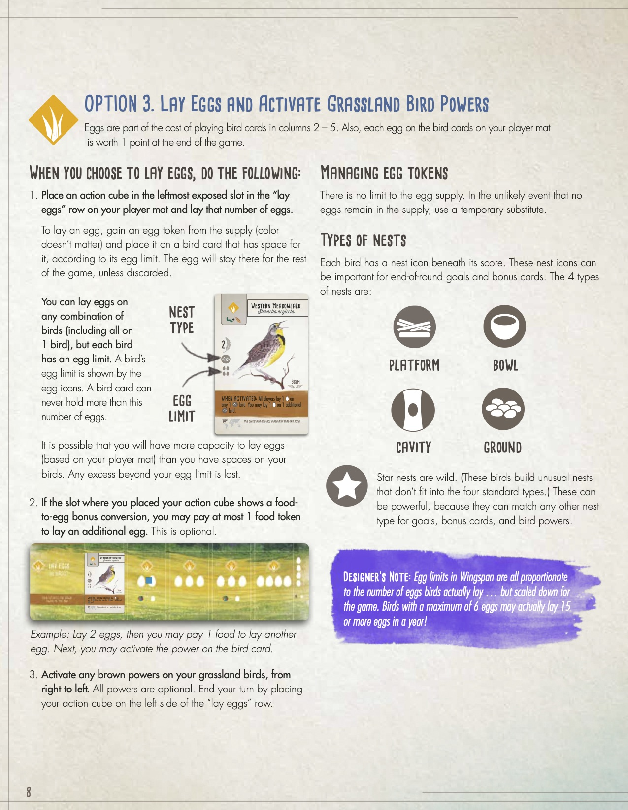

First off this page looks great and has plenty of whitespace. It's easy to scan
and hard to lose yourself in. The title structure is also clear with a section
title and subtitles clearly readable.

In comparison, this page from [_Ticket to Ride_][ttr-aff] is much more dense. It
uses titles to add some structure, but it's hard to know what's important in
those long paragraphs. Processes aren't clearly separated from rules and the
diagrams are very general.

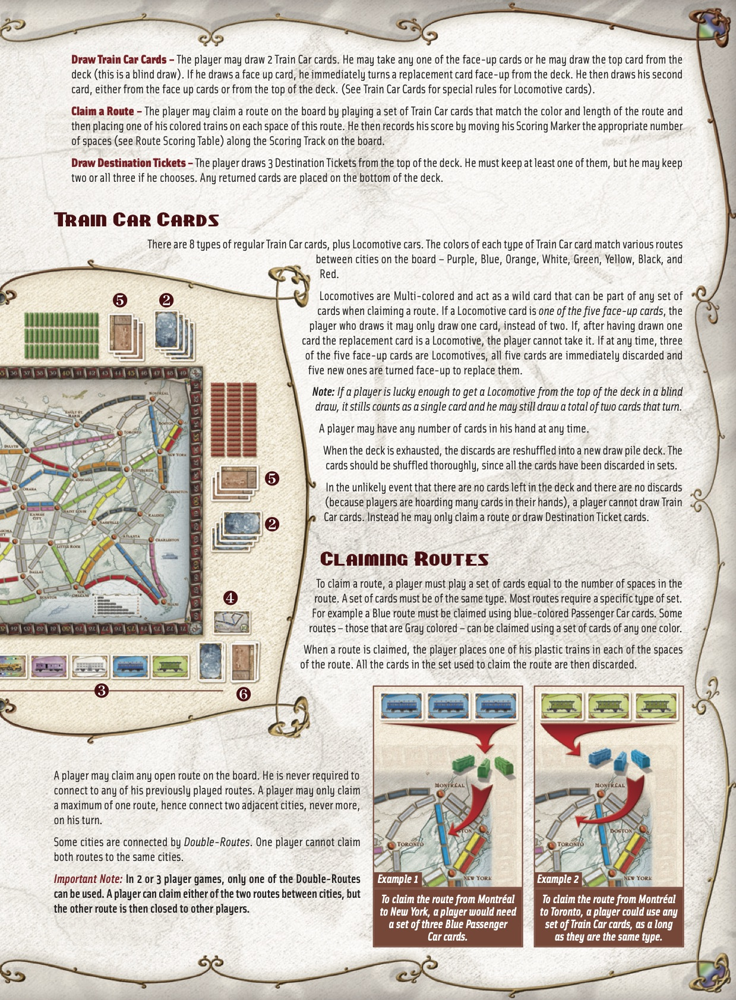

The key to Wingspan's rulebook is the progressive information disclosure. Take
this example...

- The title makes it clear that this is a _process_.
- The **bold** text describes what to do in basic terms – but not in too much
  detail as this is "Option 3" so we're already familiar with the rough
  mechanics.
- The regular weight text then provides further detail that you probably don't
  need to scan through.
- The bracketed text clarifies a handy little detail that you typically won't
  need to refer back to (that egg colour doesn't matter).

You can read any of these 4 levels and come away with a level of information
appropriate for that level. Whether you're reading for the first time, quickly
trying to find the most important rules to teach friends eager to start playing,
or scanning to find the specifics of a rule, it's easy to find the right level
of detail for your needs.

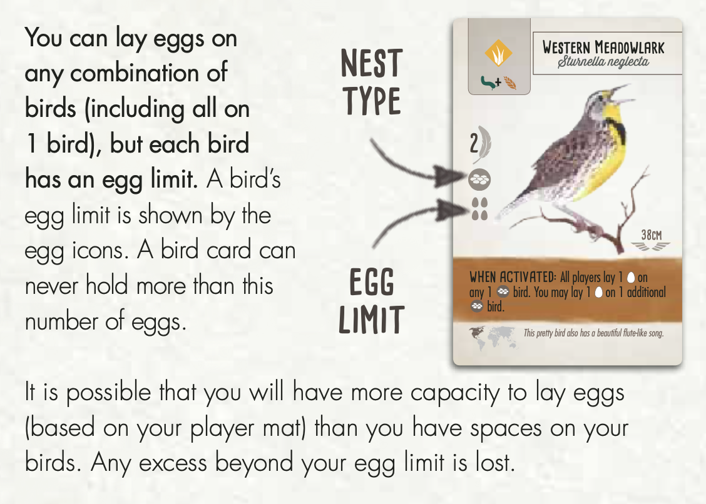

The description then includes a diagram. Many rulebooks make use of diagrams to
explain large concepts, but Wingspan makes great use of small diagrams right
next to the relevant text with very specific detail in them, rather than the
small number of overly abstract diagrams that _Ticket to Ride_ features.

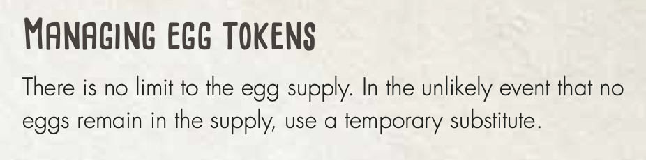

After all the steps the rulebook presents extra details. This one in particular
stood out to me because it fills in a gap that is often filled in by "house
rules". Every family has house rules for Monopoly, often filling in gaps (or
perceived gaps) in the rules. A classic instance is:

> _What happens when there are no more houses or hotels?_

While it's not much of a problem to make up a rule to fill in a gap, that rule
won't be play-tested or be consistent with the rest of the rules. Much of the
enjoyment of board games (and dislike of Monopoly) comes down to the _balance_
achieved through play-testing, and much of the ease of playing a game comes
from the _consistency_ of a single vision of the rules.

In this case, the designers of Wingspan have likely tested the option for
capping the number of eggs in the game, and decided that it plays better with no
limit. Noting this intention is a nice touch.

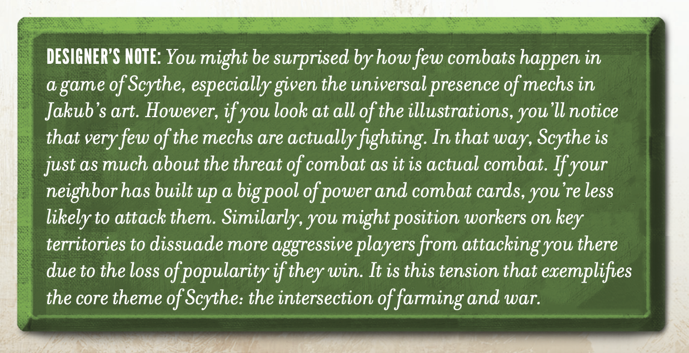

Speaking of the designers, they often crop up in the Wingspan and Scythe
rulebooks. I liked this example particularly because it helps to set
expectations about how the game plays.

The detail about the _threat_ of combat being as important as actual combat is
true in my experience with Scythe, and creates a fun tension when playing, while
serving to highlight the immense detriment that combat has on both sides. These
designers' notes are a nice way to express opinion and encourage a certain
culture surrounding the games without making those aspects feel like rules to be
abided by, and without carrying the mental overhead of something to learn,
remember, or read through when looking for that crucial rule check in the midst
of battle.

The last detail that stood out in Wingspan's rulebook was the decision to break
some details out in to an appendix. In the game there are 170 bird cards with
many different powers. In the same way that clear use of titles, emphasis in
text, and diagrams creates progressive information disclosure that makes the
rulebook so easy to process, moving the nitty gritty details into an appendix
does the same. It's clear that this is reference material not designed to be
learned.

This multi-layered approach to rulebooks – quick-start cards, main rules,
detailed reference – is one of the key design details that stands out to me from
the rules in these games. This made the process of learning the games much
easier for me, but more importantly when I came to share these games with others
I had a better understanding of what was important to share and what could wait
for later, allowing first-time players to have a much better time than they
might otherwise.

## Consistent iconography

Another detail that stood out to me was the consistent use of iconography
throughout both of these games from Stonemaier. Most games have some sort of
iconography but for complex games this becomes more important to convey rules
and concepts. What I've found different about these two games is how they take
iconography further, embedding it in the processes, rulebook, and rule
combinations throughout.

Let's take a look at the resources in Scythe...

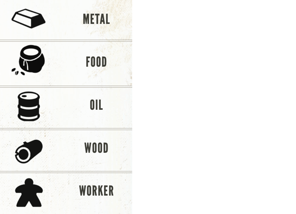

Scythe has 5 core resources that players use in their economies. These are
represented by the icons above.

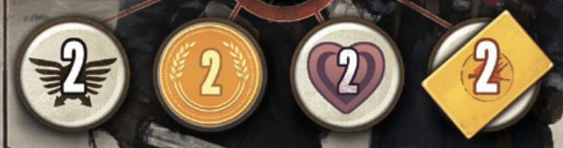

Scythe also has a number of "currencies" – military power, coins,
popularity, and combat cards (the context these are being shown in, and the "2"
is not important here).

Lastly there are a few other core game mechanics that have icons. The territory
tiles that players move about are hexagonal on the board and represented by
hexagon ⬡ icons and stars ★ are the end-game mechanic.

Like most board games, Scythe uses these icons on the board to indicate
relevance...

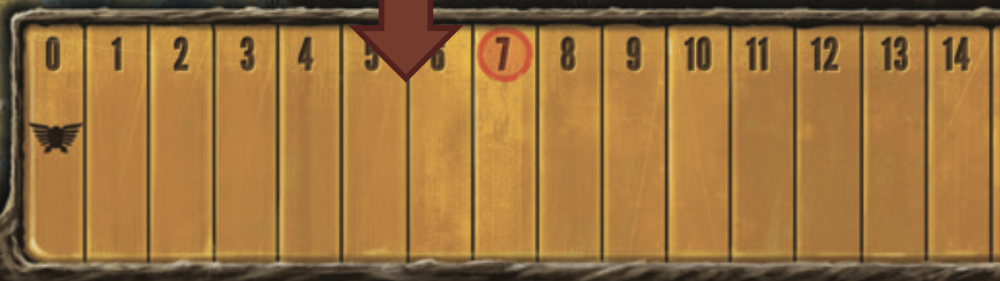
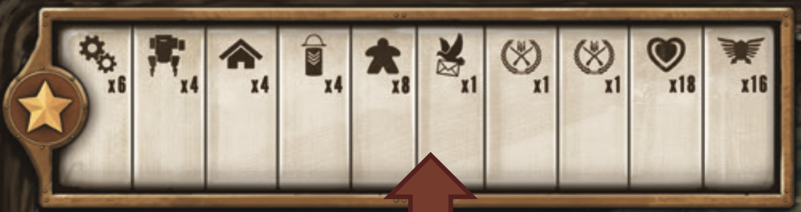
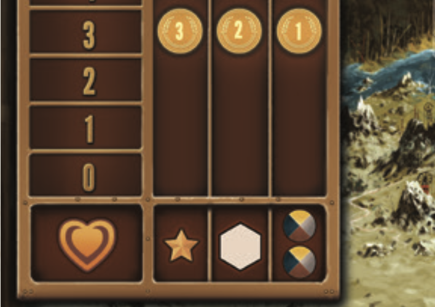

Not only are the icons labelling an area of the board, but in many cases they
are used next to other icons to show relationships between actions or resources.
In this case we can see that having a popularity of 0-3 will get us 3 coins per
star ★, 2 coins per territory ⬡, etc.

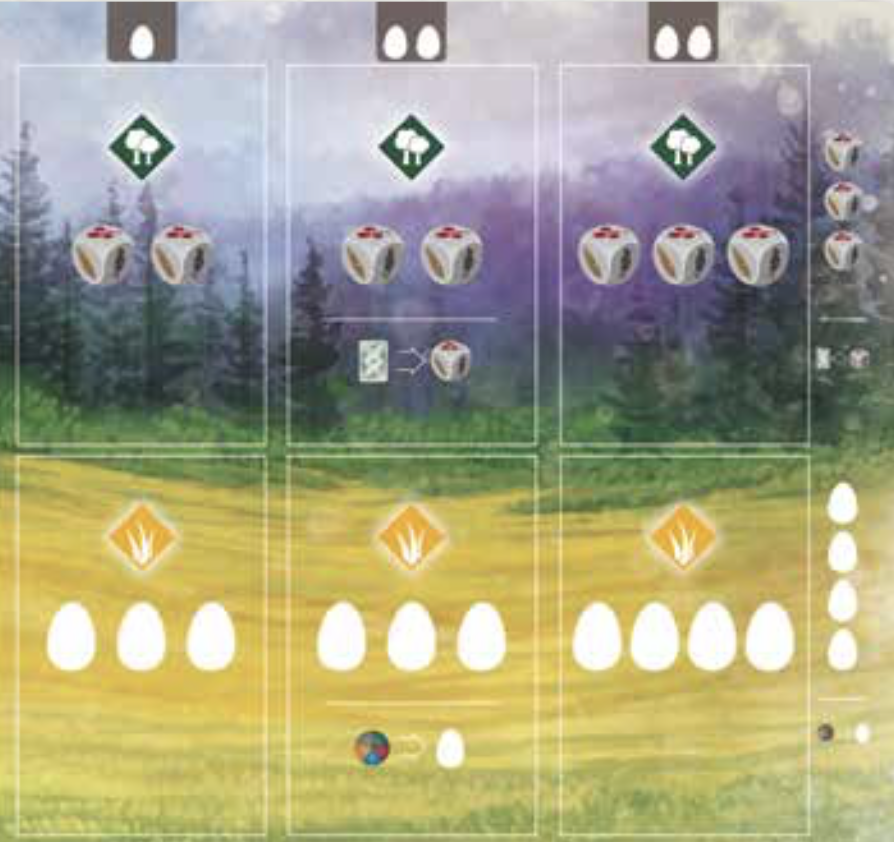

Wingspan also does this, in fact most of the content on the per-player boards
are simply combinations of icons explaining what can be done.

 

Wingspan goes a step further and uses its icons in-line in the rulebook,
even in the middle of a paragraph in true Tuftian form[^1].

The next step that Scythe takes however is what I think makes it stand out from
most other games, and that's to combine iconography in systematic ways to build
new concepts that are intuitive and don't need explaining (once the player
realises they can trust the icons).

This first example combines the concept of a territory ⬡ and a resource to
describe territories that create resources, a key concept in the game.

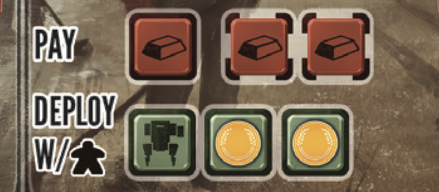

Even more interesting to me is how these combinations form costs and benefits in
the game. Since the game is focused around building an economy, a core gameplay
mechanic is paying a cost and receiving a benefit. Green and Red (always in
these shades) are used to signify these concepts in many places, and combined
with other icons to describe complex concepts. Here we can see that when
performing this action, the player will...

- Pay 3 metal
- Get a mech (another icon not described above)
- Get 2 coins
- Must deploy that mech where the player has a worker (another new icon)

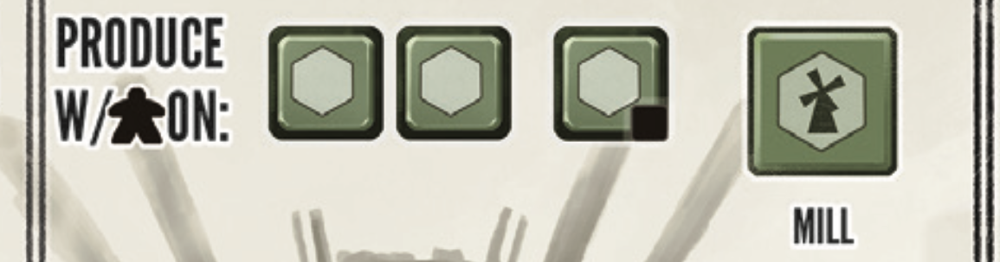

This example shows an even more complex combination – the player can "produce"
with 3 workers, on territories ⬡, plus in this case another territory that
contains a Mill. It takes a lot of words to describe what can happen here, but
the reason why these icons make such a difference is that when playing you can
scan the board—worker, territory, mill, benefit—and understand what is
represented without having to think through the full details

The only analogy I can draw is that of mathematical notation. We use notation
for mathematical concepts because they are abstract and complex, and have very
nuanced rules that it's hard to capture in text. In this way the iconography is
a powerful tool for understanding the complex systems of the game, and an aspect
of design worthy of appreciation.

## Physical checklists

The last aspect that I found to be a genius piece of design in Scythe and
Wingspan was the use of tokens to encourage correct processes throughout
gameplay. I've seen similar concepts before, [_The Resistance_][resistance-aff]
and [_Secret Hitler_][secret-aff] both use round markers of various kinds
rotating around players to clarify who is in control at any point. This is
sometimes useful in as players can get lost in discussion and forget where they
are, but in practice their use feels a little contrived most of the time.

Scythe uses tokens to cover certain details on the board and reveal them at a
later time. This in itself isn't groundbreaking, but it's done in conjunction
with the meta rule that anything visible in the game applies, and anything not
visible doesn't apply. Scythe uses this to represent the advancement of players'
economies. Over time players upgrade their abilities and in doing so move a
token that was previously covering a _benefit_, to now cover a _cost_,
accelerating the economy.

This ties in beautifully with the consistent cost/benefit process in the game,
and means that players have a clear visual representation of what they can do
_right now_, rather than having to combine multiple sources of information to
figure out those details.

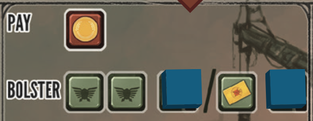

In this example, the player must pay 1 coin for this action and can receive
either 2 power or 1 combat card. If they choose to upgrade this action though,
they will pick up one of the tokens revealing a further 1 power or combat card.

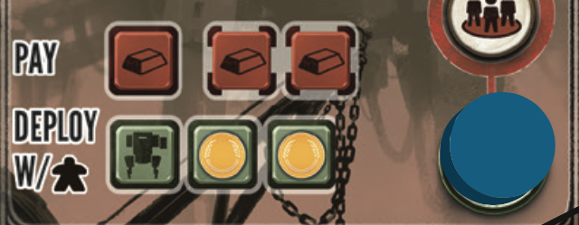

In performing this upgrade, they will then move that token down the board to
cover one of the red costs associated with a related action. The board used for
this even has depressed areas to indicate valid placements. The clarity that
this design affords the player is great, but it goes further than just easy
understanding of the state of the board...

The use of the physical tokens placed in designated spots on the board creates a
sort of "physical checklist". It's not possible to have a spare token, it's not
possible to accidentally upgrade, and it's not possible to only partially
complete an upgrade.

A more advanced illustration of this is given in Wingspan's action tokens. The
game takes place in rounds, where in each round a player will have multiple
turns. Each turn progresses as such...

1. The player takes an action token and places it on their player grid, on the
   row representing the type of move they are taking, and in the left-most empty
   column.
2. They take the resources indicated in the square their action token is in.
3. They move the action token left down the row, one square at a time, taking
   the actions in those squares as well.
4. Their token reaches the end of the board and their turn is complete. The
   token stays on the board.

When the player have no more action tokens left, the round is scored. Each
player places an action token on the scoring ladder.

There are a number of neat features about this process:

- At any time the location of the action token tells a player what they need to
  do next.
- As players build their "engine"[^2] along the rows, their action tokens have
  more places to move increasing the velocity of the game.
- As turns are completed, players have fewer action tokens not yet on the board.
- As rounds are completed, players have one less action token each round,
  shortening rounds that are otherwise becoming more complex and taking longer.

Again there's a physical checklist, players can't take too many turns because
their turns are physically represented and moved around the board. They are also
less likely to forget to take an action because they are moving a token across
it.

I'm a big [fan of checklists][checklist] in running processes in the workplace,
but in board games the aim is to have fun. [Much has also been
written][pointing] about how deliberate physical action helps reduce mistakes.
But why do we want a checklist, and why do we need to reduce mistakes in board
games?

For me, board games become fun when the _practicalities_ disappear and the focus
moves to the player dynamics. If I'm spending time calculating allowed moves
instead of being able to clearly see them, or if I'm missing phases of my turn
and backtracking or just creating an unbalanced game, then I'm too focused on
the practicalities, when I could instead be focusing on enjoying some
competition with my friends. A checklist (even if somewhat hidden) helps those
practicalities become natural and disappear so that the focus can be on the
dynamics.

---

Wingspan and Scythe are well respected but by no means the best board games on
the market. Whether you're into card games or RPGs, classics or new games, party
games or brutal day-long campaigns, there may be better games for you, many of
which may feature even better design elements. I focused on these two games
because they are games I have enjoyed, and because they made me think about game
design in ways I hadn't thought about it before.

While these design details are quite board game specific, I think there are more
general versions that can be applied to the design of a broad range of games,
products, processes, and more.

- **Clear documentation**  
  Documentation that has been _designed_ is far better than documentation that
  has just been written. The [Django documentation][django] is a world-class
  example from the web development world, and the [GOV.UK][govuk] website has
  many examples of well structured, accessible documentation designed to be
  usable by almost anyone.

- **Consistent system design**  
  My key takeaway from Scythe's iconography is the system of notation that it
  creates. By teaching players basic rules and then recombining those in
  consistent ways, it creates something that is more than the sum of its parts.
  This is the power of building _systems_, rather than everything being an
  exception.

- **Making process disappear**  
  Lastly, checklists, abstract or otherwise, can help make boring practicalities
  disappear easy and quick, allowing us to focus on what really matters and
  where we can add value – whether that value is our expert knowledge in the
  workplace, or figuring out our friends' strategies.

[^1]:
  Edward Tufte, author of [_The Visual Display of Quantitative
  Information_][visual-aff], described
  [sparklines](https://en.wikipedia.org/wiki/Sparkline) – compact data
  representation, often presented in-line in text or very close to it rather
  than as separate figures to be referenced.

[^2]:
  Engine building games are a type of board game. They typically feature a
  feedback loop that causes action to accelerate throughout gameplay. Players
  earn resources or abilities, those let them earn more resources even faster.

[pointing]: https://www.atlasobscura.com/articles/pointing-and-calling-japan-trains
[checklist]: /2019-09-22-checklist-manifesto/
[django]: https://docs.djangoproject.com/
[govuk]: https://www.gov.uk
[scythe-aff]: https://amzn.to/2Ti7GjC
[stonemaier]: https://stonemaiergames.com
[wingspan-aff]: https://amzn.to/2TpuIoW
[secret-aff]: https://amzn.to/3bJitcZ
[resistance-aff]: https://amzn.to/3g85Ifm
[ttr-aff]: https://amzn.to/2LFZ4Pt
[visual-aff]: https://amzn.to/3bOlSHz
